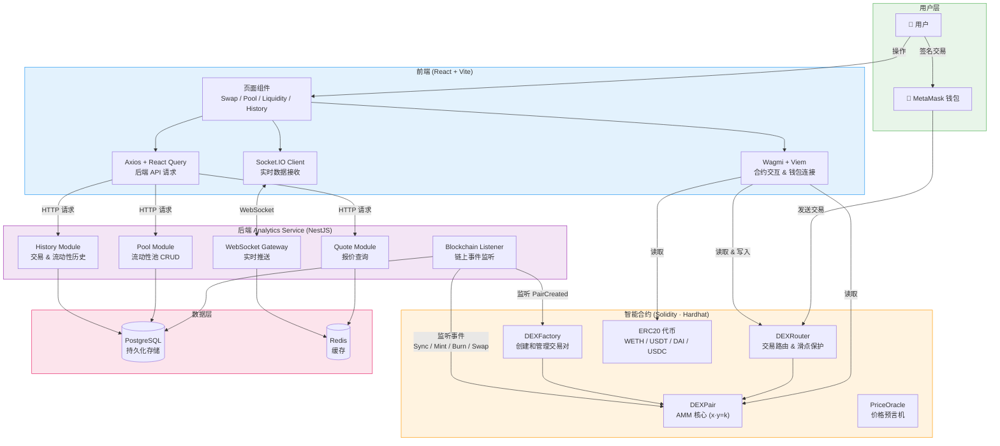

# DEX - 去中心化交易所

> 基于 Uniswap V2 协议的去中心化交易所实现，毕业设计项目。

[](https://www.typescriptlang.org/)
[](https://reactjs.org/)
[](https://nestjs.com/)
[](https://soliditylang.org/)

---

## 项目简介

本项目是一个基于 **Uniswap V2** 协议实现的去中心化交易所（DEX），涵盖以下核心功能：

- **Swap** - 代币兑换（基于 AMM 恒定乘积公式 x*y=k）
- **Liquidity** - 流动性添加 / 移除
- **Pool** - 流动性池管理与详情查看
- **History** - 完整的交易和流动性操作历史记录
- **Analytics** - 实时数据同步与统计分析
- **Price Oracle** - 价格预言机（Mock Chainlink Aggregator）

### 核心特点

- **去中心化交易** - 用户通过 MetaMask 钱包签名交易，链上执行
- **AMM 自动做市** - 基于 Uniswap V2 恒定乘积公式，0.3% 交易手续费
- **实时数据同步** - 后端监听链上事件，WebSocket 实时推送前端
- **完整的数据分析** - Swap / Mint / Burn 历史记录，池子 TVL、交易量统计

---

## 技术栈

### 智能合约
| 技术 | 说明 |
|------|------|
| Solidity 0.8.20 | 合约语言 |
| Hardhat | 开发、编译、部署框架 |
| Uniswap V2 | AMM 协议（Factory、Router、Pair） |
| OpenZeppelin | 安全的 ERC20 标准实现 |

### 后端（Analytics Service）
| 技术 | 说明 |
|------|------|
| NestJS 10 | Node.js 框架 |
| TypeORM | ORM 数据库操作 |
| PostgreSQL | 持久化存储 |
| Redis | 缓存 |
| Socket.IO | WebSocket 实时通信 |
| Viem | 以太坊只读查询 |

### 前端
| 技术 | 说明 |
|------|------|
| React 18 | UI 框架 |
| Vite | 构建工具 |
| Ant Design | UI 组件库 |
| Wagmi + Viem | 以太坊交互（钱包连接、合约调用） |
| Zustand | 状态管理 |
| React Query | 数据请求与缓存 |

---

## 系统架构



### 数据流说明

| 操作 | 数据流 |
|------|--------|
| **Swap 交易** | 用户 → MetaMask 签名 → Router 合约 → Pair 合约执行 → 后端监听 Swap 事件 → 写入数据库 → WebSocket 推送前端 |
| **添加流动性** | 用户 → MetaMask 签名 → Router 合约 → Pair 合约 mint LP → 后端监听 Mint 事件 → 写入数据库 |
| **查询数据** | 前端 → HTTP 请求后端 API → 数据库查询 → 返回前端展示 |
| **实时更新** | Pair 合约触发 Sync 事件 → 后端 Listener 捕获 → 更新数据库 → WebSocket 推送前端 |

---

## 项目结构

```
uniswap-/
├── contracts/                # 智能合约
│   ├── contracts/
│   │   ├── core/            # Uniswap V2 核心（Factory, Pair, Router）
│   │   ├── periphery/       # 路由器等外围合约
│   │   ├── oracle/          # 价格预言机
│   │   ├── farming/         # 流动性挖矿（扩展功能）
│   │   └── test/            # 测试用 MockERC20
│   └── scripts/             # 部署脚本
│       ├── deploy.ts        # 核心合约部署
│       ├── deploy-farming.ts
│       ├── deploy-oracle.ts
│       ├── mint-tokens.js   # 铸造测试代币
│       └── add-liquidity.ts # 添加初始流动性
│
├── backend/
│   └── services/
│       ├── analytics-service/  # 数据分析服务（主服务，端口 3002）
│       └── wallet-service/     # 钱包服务（端口 3001）
│
├── frontend/
│   └── web-app/             # React 前端应用（端口 3000）
│
└── scripts/                 # 运维脚本
    └── sync-all-pools.sh    # 同步链上池子到数据库
```

---

## 快速开始

### 前置要求

- Docker（运行 PostgreSQL + Redis）
- Node.js >= 18
- pnpm >= 8
- MetaMask 浏览器插件

### 启动步骤

详细的分步指南请参考 [start.md](./start.md)，以下是简要流程：

```bash
# 1. 启动 Docker（PostgreSQL + Redis）
cd backend
docker-compose up -d

# 2. 启动 Hardhat 本地节点
cd contracts
npx hardhat node

# 3. 部署合约（新终端）
npx hardhat run scripts/deploy.ts --network localhost
npx hardhat run scripts/deploy-farming.ts --network localhost
npx hardhat run scripts/deploy-oracle.ts --network localhost

# 4. 铸造测试代币 + 添加流动性
npx hardhat run scripts/mint-tokens.js --network localhost
npx hardhat run scripts/add-liquidity.ts --network localhost

# 5. 启动后端服务
cd backend/services/analytics-service
pnpm run start:dev

# 6. 同步池子数据到数据库
cd ../../..
bash scripts/sync-all-pools.sh

# 7. 启动前端
cd frontend/web-app
pnpm run dev
```

### 访问地址

| 服务 | 地址 |
|------|------|
| 前端应用 | http://localhost:3000 |
| 后端 API | http://localhost:3002 |
| API 文档 | http://localhost:3002/api/docs |
| Hardhat 节点 | http://127.0.0.1:8545 |

### 配置 MetaMask

1. 添加自定义网络：
   - 网络名称：Hardhat Local
   - RPC URL：http://127.0.0.1:8545
   - Chain ID：31337
   - 货币符号：ETH

2. 导入测试账户私钥：
   ```
   0xac0974bec39a17e36ba4a6b4d238ff944bacb478cbed5efcae784d7bf4f2ff80
   ```
   导入后余额约 10000 ETH。

---

## Uniswap V2 核心概念

### AMM（自动做市商）

采用恒定乘积公式 `x * y = k`：
- 每个交易对由两种代币组成，维护储备量（Reserve）
- 交易时自动计算价格，无需订单簿
- 每笔交易收取 **0.3%** 手续费，分配给流动性提供者

### 核心合约

| 合约 | 功能 |
|------|------|
| **DEXFactory** | 创建和管理交易对，记录所有 Pair 地址 |
| **DEXPair** | 交易对合约，存储两种代币的储备量，执行 swap/mint/burn |
| **DEXRouter** | 路由合约，提供用户友好的交易接口（滑点保护、deadline） |
| **WETH9** | 将 ETH 包装为 ERC20，使 ETH 能参与交易对 |

### 关键操作

- **Swap**：用户用代币 A 兑换代币 B，Router 计算最优路径并执行
- **Add Liquidity**：按当前比例存入两种代币，获得 LP Token
- **Remove Liquidity**：燃烧 LP Token，按比例取回两种代币

---

## 常用命令

```bash
# 铸造测试代币
cd contracts
npx hardhat run scripts/mint-tokens.js --network localhost

# 同步链上池子到数据库
bash scripts/sync-all-pools.sh

# 重新部署（Hardhat 节点重启后需要）
npx hardhat run scripts/deploy.ts --network localhost
```

---

## 相关文档

| 文档 | 说明 |
|------|------|
| [start.md](./start.md) | 完整启动指南（本地 + Sepolia） |
| [scripts/README.md](./scripts/README.md) | 运维脚本说明 |
| [frontend/web-app/README.md](./frontend/web-app/README.md) | 前端说明 |
| [contracts/.env.deployed](./contracts/.env.deployed) | 当前部署的合约地址 |

---

## 致谢

- [Uniswap V2](https://uniswap.org/) - AMM 协议参考实现
- [NestJS](https://nestjs.com/) - 后端框架
- [React](https://reactjs.org/) - 前端框架
- [Viem](https://viem.sh/) / [Wagmi](https://wagmi.sh/) - 以太坊交互库

---

**最后更新：** 2026-03-06
