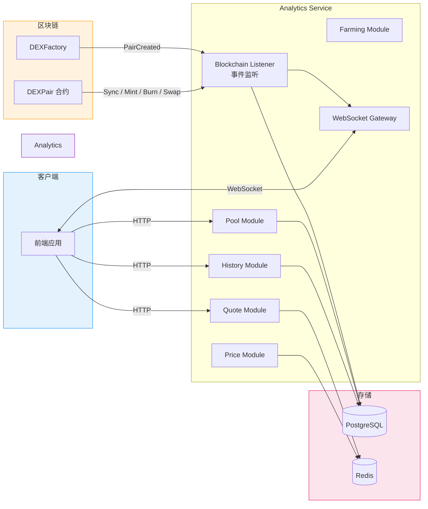

# Analytics Service

DEX 数据分析服务 — 负责链上数据同步、流动性池管理、价格查询、交易历史记录和实时推送。

## 架构概览



## 功能模块

### Pool（流动性池管理）
- 获取/创建交易对池子
- 查询池子列表和详情
- 从链上同步池子数据（Reserve、TVL）
- 池子统计信息

### Quote（价格查询）
- 获取交易报价（指定输入/输出金额）
- 批量价格查询
- 实时价格信息

### History（交易历史）
- Swap 交易记录
- 流动性操作记录（Mint / Burn）
- 按池子或用户查询

### Blockchain Listener（链上事件监听）
- 监听 Factory 的 PairCreated 事件（自动发现新交易对）
- 监听 Pair 合约的 Sync / Mint / Burn / Swap 事件
- 实时同步链上数据到数据库

### Price（价格服务）
- 集成 PriceOracle 合约查询代币 USD 价格
- 价格缓存

### Farming（流动性挖矿 - 扩展功能）
- MasterChef 矿池数据同步
- 用户质押信息查询

### Analytics（数据统计）
- 交易量统计
- TVL 统计

## 快速开始

### 1. 安装依赖

```bash
pnpm install
```

### 2. 配置环境变量

`.env` 文件由合约部署脚本自动生成和更新。如需手动创建：

```env
PORT=3002
DATABASE_HOST=localhost
DATABASE_PORT=5432
DATABASE_USERNAME=dex_user
DATABASE_PASSWORD=dex_password
DATABASE_NAME=dex_trading
REDIS_HOST=localhost
REDIS_PORT=6379
BLOCKCHAIN_RPC_URL=http://127.0.0.1:8545
BLOCKCHAIN_RPC_WS_URL=ws://127.0.0.1:8545
BLOCKCHAIN_CHAIN_ID=31337
DEX_FACTORY_ADDRESS=0x...
DEX_ROUTER_ADDRESS=0x...
WETH_ADDRESS=0x...
```

### 3. 启动服务

```bash
# 开发模式（热重载）
pnpm run start:dev

# 生产模式
pnpm run build
pnpm run start:prod
```

## API 文档

启动服务后访问 Swagger 文档：http://localhost:3002/api/docs

## 主要 API 端点

### Pool

| 方法 | 路径 | 说明 |
|------|------|------|
| POST | `/api/v1/pool` | 创建或获取池子 |
| GET | `/api/v1/pool` | 获取池子列表 |
| GET | `/api/v1/pool/stats` | 获取统计信息 |
| GET | `/api/v1/pool/:id` | 获取池子详情 |
| POST | `/api/v1/pool/:id/refresh` | 刷新池子链上数据 |
| GET | `/api/v1/pool/pair/:token0/:token1` | 根据代币地址查询池子 |
| GET | `/api/v1/pool/address/:pairAddress` | 根据 Pair 地址查询池子 |

### Quote

| 方法 | 路径 | 说明 |
|------|------|------|
| POST | `/api/v1/quote` | 获取报价（指定输入金额） |
| POST | `/api/v1/quote/exact-out` | 获取报价（指定输出金额） |
| POST | `/api/v1/quote/batch` | 批量查询价格 |
| GET | `/api/v1/quote/price/:token0/:token1` | 获取实时价格 |

### History

| 方法 | 路径 | 说明 |
|------|------|------|
| GET | `/api/v1/history/swaps` | 获取 Swap 历史 |
| GET | `/api/v1/history/liquidity` | 获取流动性操作历史 |

### Farming

| 方法 | 路径 | 说明 |
|------|------|------|
| GET | `/api/v1/farming/farms` | 获取所有矿池 |
| GET | `/api/v1/farming/farms/:poolId` | 获取矿池详情 |

## 技术栈

- **框架**: NestJS 10
- **语言**: TypeScript 5
- **数据库**: PostgreSQL（TypeORM）
- **缓存**: Redis
- **区块链**: Viem 2.x
- **实时通信**: Socket.IO
- **API 文档**: Swagger / OpenAPI

## 项目结构

```
src/
├── common/                    # 公共模块
│   └── config/                # 配置（数据库、Redis、区块链等）
├── providers/
│   ├── blockchain/            # 区块链交互（PublicClient、合约调用）
│   └── cache/                 # Redis 缓存
├── modules/
│   ├── pool/                  # 流动性池管理
│   ├── quote/                 # 价格查询
│   ├── history/               # 交易历史（Swap / Liquidity）
│   ├── blockchain-listener/   # 链上事件监听与数据同步
│   ├── price/                 # 价格服务（Oracle 集成）
│   ├── farming/               # 流动性挖矿（扩展功能）
│   └── analytics/             # 数据统计
├── app.module.ts
└── main.ts
```

## 环境变量说明

| 变量名 | 说明 | 默认值 |
|--------|------|--------|
| PORT | 服务端口 | 3002 |
| DATABASE_HOST | 数据库主机 | localhost |
| DATABASE_PORT | 数据库端口 | 5432 |
| DATABASE_USERNAME | 数据库用户名 | dex_user |
| DATABASE_PASSWORD | 数据库密码 | dex_password |
| DATABASE_NAME | 数据库名称 | dex_trading |
| REDIS_HOST | Redis 主机 | localhost |
| REDIS_PORT | Redis 端口 | 6379 |
| BLOCKCHAIN_RPC_URL | 区块链 RPC 地址 | http://127.0.0.1:8545 |
| BLOCKCHAIN_RPC_WS_URL | WebSocket RPC 地址 | ws://127.0.0.1:8545 |
| BLOCKCHAIN_CHAIN_ID | 链 ID | 31337 |
| DEX_FACTORY_ADDRESS | Factory 合约地址 | - |
| DEX_ROUTER_ADDRESS | Router 合约地址 | - |
| WETH_ADDRESS | WETH 合约地址 | - |
| MASTERCHEF_ADDRESS | MasterChef 合约地址 | -（可选） |
| PRICE_ORACLE_ADDRESS | PriceOracle 合约地址 | -（可选） |

## License

MIT
